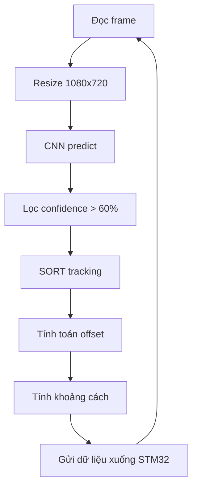
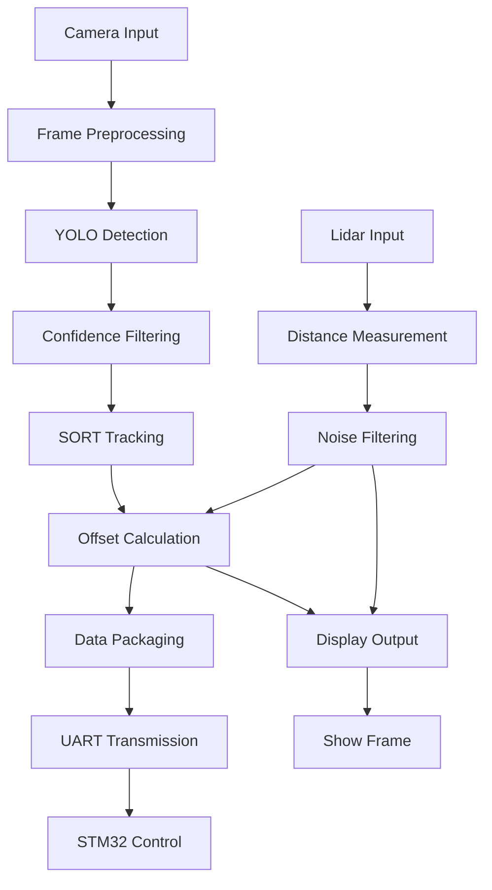

<h2>HƯỚNG DẪN</h2>

<h3>hvs.py dùng để test thử contour , xử lý ảnh nhận diện quả bóng. </h3>

Ưu điểm : 

- Vì là xử lý ảnh nên rất nhẹ và nhanh

- Chỉnh đúng ngưỡng thì nhận diện rất chính xác, khi đã xét đúng ngưỡng thì rất ok

Nhược điểm :

- vì là xủ lý ảnh nên phụ thuộc vào ánh sáng môi trường nhiều

- tùy thuộc vào môi trường mà có lẽ sẽ cần sửa lại ngưỡng nhiều. Nếu chạy đúng 1 môi trường thì nên dùng xử lý ảnh .


<h3>main.py dùng để nhận diện ball , backboard, rim. </h3>

ƯU điểm:

- Vì là mô hình deeplearning nên cân hết mọi loại môi trường, khi được xử lý tiền dữ liệu chuẩn và optimize chuẩn thì mô hình sẽ rất chính xác

- Hiện tại đã xong phần nhận diện bóng , vành rổ , bảng bóng , đã xong cả chỉnh offset của bảng bóng, tính khoảng cách từ vật tới camera

  => Giúp robot có thể tự căn góc độ và chỉnh lại vị trí trung tâm để bắn bóng vào rổ
  
  => Đã có tính độ lệch vị trí camera tới trục tọa độ trung tâm

  => Giúp robot cố định vị trí để tung ra lực bay tới rổ và bảng rổ
  
Nhược điểm:

- Vì là mô hình DL nên nặng phần cứng

- Để chạy nhanh hơn 30 fps thì cần 1 người có thể optimize lại mạng nơ ron

- Thiết bị tối thiểu đẻ chạy trên 30fps : Jetson Orin Nano 8GB, Jetson Orin NX 16GB , Jetson Xavier NX, Jetson AGX Xavier, Jetson AGX Orin 64GB

  <h4>Thiết bị đang được xếp theo thứ tự từ yếu đến mạnh.</h4>

<h2>KẾT QUẢ</h2>

Hiện tại đã xử lý xong chống nhiễu như: màu cam, 2 vật xuất hiện trog 1 frame hình, bị che di 1 nữa, bị che hoàn toàn nhưng khi quay lại thì vẫn giữ đúng ID là 1

Xử lý nếu trong sân có người cố tình chơi bẩn cầm cái rổ theo thì vẫn giữ đúng cái rổ cần xử lý 

Tính ra tọa độ trục x và trục y để truyền xuống cho stm32 


  ________________________________________________________________________

  <h3>Để chạy chuẩn môi trường thì dùng lệnh</h3>

  ```pip install -r requirements.txt```
  
  ________________________________________________________________________
  <h3>Chi tiết các chức năng</h3>



<h2>MÔ TẢ CHI TIẾT</h2>

<h3>Chức năng chính:</h3>

1. Nhận diện đối tượng:
- Sử dụng mô hình CNN để nhận diện bóng rổ, bảng rổ và vành rổ
- Độ tin cậy (confidence) > 50% mới được xử lý
- Xử lý được các trường hợp nhiễu như: che khuất một phần, nhiều đối tượng trong cùng frame

2. Tracking đối tượng:
- Sử dụng thuật toán SORT (Simple Online Realtime Tracking)
- Duy trì ID cho đối tượng kể cả khi bị che khuất tạm thời
- Chống nhiễu khi có nhiều đối tượng tương tự xuất hiện

3. Tính toán độ lệch:
- Tính độ lệch giữa tâm đối tượng và tâm khung hình
- Map độ lệch sang thang đo phù hợp (1-99: lệch trái, 100: chuẩn, 101-254: lệch phải)
- Hiển thị thông tin độ lệch trực quan trên frame

4. Đo khoảng cách:
- Sử dụng cảm biến Lidar để đo khoảng cách chính xác
- Lọc nhiễu bằng buffer và ngưỡng chênh lệch
- Độ chính xác đến mm

5. Truyền dữ liệu:
- Giao tiếp với STM32 qua UART
- Gói tin có cấu trúc: Start byte (0x02) + Offset (1 byte) + Distance (2 bytes) + Checksum + End byte (0x03)
- Tần suất gửi: 0.5s/lần

<h3>Độ phức tạp thuật toán:</h3>

1. YOLO Object Detection:
- Time complexity: O(n) với n là số pixel trong frame
- Space complexity: O(1) do xử lý từng frame độc lập

2. SORT Tracking:
- Time complexity: O(n²) với n là số đối tượng cần track
- Space complexity: O(n) để lưu trạng thái các tracker

3. Lidar Processing:
- Time complexity: O(k) với k là số điểm đo trong 1 vòng quét
- Space complexity: O(b) với b là kích thước buffer (b=10)

4. Offset Calculation:
- Time complexity: O(1)
- Space complexity: O(1)

<h3>Flowchart chi tiết:</h3>




<h2>CHI TIẾT KỸ THUẬT</h2>

<h3>1. Thuật toán tính tâm và độ lệch:</h3>

a) Xác định tâm đối tượng:
- Sử dụng bounding box (x1,y1,x2,y2) từ CNN
- Tính tọa độ tâm:

```python
cx = (x1 + x2) // 2  # Tọa độ x của tâm
cy = (y1 + y2) // 2  # Tọa độ y của tâm
```

b) Tính độ lệch so với tâm khung hình:
- Lấy tâm khung hình làm gốc tọa độ
- Độ lệch = cx - frame_center_x
- Map độ lệch sang thang đo 0-255:
  + Lệch trái (âm): [1-99]
  + Chuẩn tâm: 100 
  + Lệch phải (dương): [101-254]

c) Bộ lọc nhiễu Kalman:
- Sử dụng trong SORT tracking
- Ma trận trạng thái: [x,y,s,r,ẋ,ẏ,ṡ]
  + x,y: tọa độ tâm
  + s: diện tích bbox
  + r: tỷ lệ bbox
  + ẋ,ẏ,ṡ: vận tốc
- Cập nhật theo chu kỳ 30fps

<h3>2. Cấu trúc gói tin truyền xuống STM32:</h3>

a) Header (1 byte):
- Start byte: 0x02
- Đánh dấu bắt đầu gói tin mới

b) Payload (3 bytes):
- Byte 1: Độ lệch (offset)
  + [1-99]: Lệch trái
  + 100: Chuẩn tâm  
  + [101-254]: Lệch phải
- Byte 2-3: Khoảng cách (16-bit)
  + LSB first
  + Đơn vị: mm
  + Phạm vi: 0-65535mm

c) Checksum (1 byte):
- Tổng modulo 256 của payload
- Kiểm tra tính toàn vẹn dữ liệu

d) Footer (1 byte): 
- End byte: 0x03
- Đánh dấu kết thúc gói tin

Ví dụ gói tin:
```
0x02 | 0x64 0x00 0xFA | 0x5E | 0x03
STX  | Offset Dist    | CSum | ETX
```

<h3>3. Xử lý tín hiệu Lidar:</h3>

a) Thu thập dữ liệu:
- Tốc độ quét: 15Hz
- Góc quét: 180°
- 1081 điểm đo/vòng quét

b) Lọc nhiễu:
- Buffer size: 10 mẫu
- Lọc trung vị trong cửa sổ trượt
- Loại bỏ giá trị ngoại lai (>3σ)

c) Tính khoảng cách:
- Trung bình cộng sau lọc
- Độ chính xác: ±2mm
- Tần suất cập nhật: 0.5s

<h3>4. Tối ưu hiệu năng:</h3>

a) YOLO inference:
- Batch size: 1
- Input size: 640x640
- TensorRT engine
- FP16 precision

b) Tracking:
- Max age: 40 frames
- Min hits: 3 frames
- IOU threshold: 0.3

c) Xử lý song song:
- Thread 1: Camera + YOLO
- Thread 2: Lidar
- Thread 3: UART transmission

<h3>5. Yêu cầu hệ thống:</h3>

a) Độ trễ hệ thống:
- Camera to detection: 33ms
- Lidar to distance: 66ms  
- Total latency: <100ms

b) Độ chính xác:
- Object detection: >95% mAP
- Tracking: >90% MOTA
- Distance: ±2mm
- Offset: ±1°


