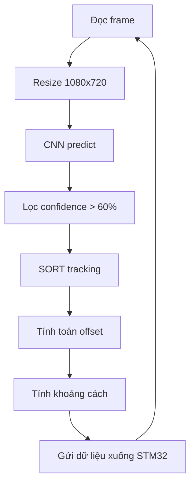

<h2>HƯỚNG DẪN</h2>

<h3>hvs.py dùng để test thử contour , xử lý ảnh nhận diện quả bóng. </h3>

Ưu điểm : 

- Vì là xử lý ảnh nên rất nhẹ và nhanh

- Chỉnh đúng ngưỡng thì nhận diện rất chính xác, khi đã xét đúng ngưỡng thì rất ok

Nhược điểm :

- vì là xủ lý ảnh nên phụ thuộc vào ánh sáng môi trường nhiều

- tùy thuộc vào môi trường mà có lẽ sẽ cần sửa lại ngưỡng nhiều. Nếu chạy đúng 1 môi trường thì nên dùng xử lý ảnh .


<h3>main.py dùng để nhận diện ball , backboard, rim. </h3>

ƯU điểm:

- Vì là mô hình deeplearning nên cân hết mọi loại môi trường, khi được xử lý tiền dữ liệu chuẩn và optimize chuẩn thì mô hình sẽ rất chính xác

- Hiện tại đã xong phần nhận diện bóng , vành rổ , bảng bóng , đã xong cả chỉnh offset của bảng bóng, tính khoảng cách từ vật tới camera

  => Giúp robot có thể tự căn góc độ và chỉnh lại vị trí trung tâm để bắn bóng vào rổ
  
  => Đã có tính độ lệch vị trí camera tới trục tọa độ trung tâm

  => Giúp robot cố định vị trí để tung ra lực bay tới rổ và bảng rổ
  
Nhược điểm:

- Vì là mô hình DL nên nặng phần cứng

- Để chạy nhanh hơn 30 fps thì cần 1 người có thể optimize lại mạng nơ ron

- Thiết bị tối thiểu đẻ chạy trên 30fps : Jetson Orin Nano 8GB, Jetson Orin NX 16GB , Jetson Xavier NX, Jetson AGX Xavier, Jetson AGX Orin 64GB

  <h4>Thiết bị đang được xếp theo thứ tự từ yếu đến mạnh.</h4>

<h2>KẾT QUẢ</h2>

Hiện tại đã xử lý xong chống nhiễu như: màu cam, 2 vật xuất hiện trog 1 frame hình, bị che di 1 nữa, bị che hoàn toàn nhưng khi quay lại thì vẫn giữ đúng ID là 1

Xử lý nếu trong sân có người cố tình chơi bẩn cầm cái rổ theo thì vẫn giữ đúng cái rổ cần xử lý 

Tính ra tọa độ trục x và trục y để truyền xuống cho stm32 


  ________________________________________________________________________

  <h3>Để chạy chuẩn môi trường thì dùng lệnh</h3>

  ```pip install -r requirements.txt```
  
  ________________________________________________________________________
  <h3>Chi tiết các chức năng</h3>




